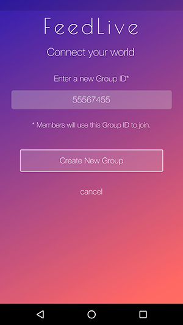
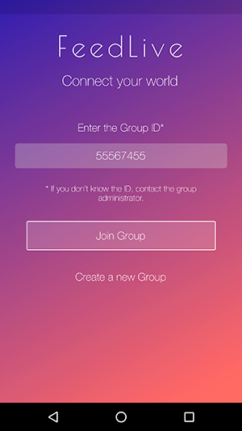
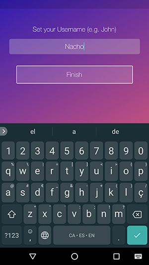
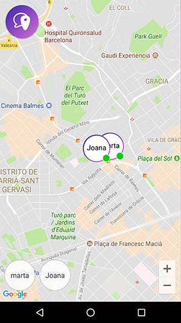

---
language_tabs:
 - notes: Notes
 
search: false
---

# Introduction

```notes
Online documentation for FeedLive version 0.6  
```

[FeedLive](http://www.feedlive.com) is a service that parents can use to enforce family communication and child protection. 


## Version Notes

**The currently available version is 0.6**. That version includes the next features.

- Only available for Android devices.
- Create group (Group Administrator).
- Login into group by just entering the related group id (Group Member).
- Track last registered location for all group devices.


## Upcoming Features

Some new features have already been scheduled for the next app versions.

Version 0.7

- Group Member approval process by Admin.
- Show last locations (not only last registered location).
- "Do not share" location option for Group Aministrators (parents).


Version 0.8

- Chating.

Version 0.9

- iOS (iPhone) version.


# How it works

## Installing

To use FeedLive, all the family members will need to install the mobile application. A parent will then be able to create a group that other members will join to share location and communicate.

<aside class="warning">
Current version (0.6) is only available for Android devices, but iOS will also be available soon (0.9).
</aside>


## Create a group

```notes
We recommend that you use a Group Id that your 
family can easely recognize and remember.

Your Phone Number is a good candidate.
```

To create your family's group, just tap on the "Create a new group" option you will find at the initial screen. Set your Group Id and press the "Create New Group" button.

<aside class="notice">
The person (device) that creates a group is considered as the group administrator and will have some privileges.
</aside>




## Join a group

To join a group (e.g. from your child's mobile), just enter the group id. 



Tap "Join Group" and device will automatically join the group and ask you to set a username (e.g. 'Jonh').




## Share location

```notes
Don't expect to get every second device location, 
as FeedLive will try to get 24x7 device 
location history without draining the battery.
```

By joining a group, a device will automatically start to share his location at regular intervals. 



To get a device location details (position datetime and accuracy) you can simply tap on the location icon. Also note that the location dot color indicates if location is up-to-date:

```notes
Not getting an up-to-date position means
device is not sending GPS location.
```


Location registered in the last 30 minutes maximum.


Location is older than 30 minutes.


Location is older than 5 hours.

# Get Support

If you have any question/request/issue/etc, please just write a new Issue [here](https://github.com/NachoColl/com.feedlive.help/issues).

<br/>
<br/>
<br/>
<br/>
<br/>
------ The End.